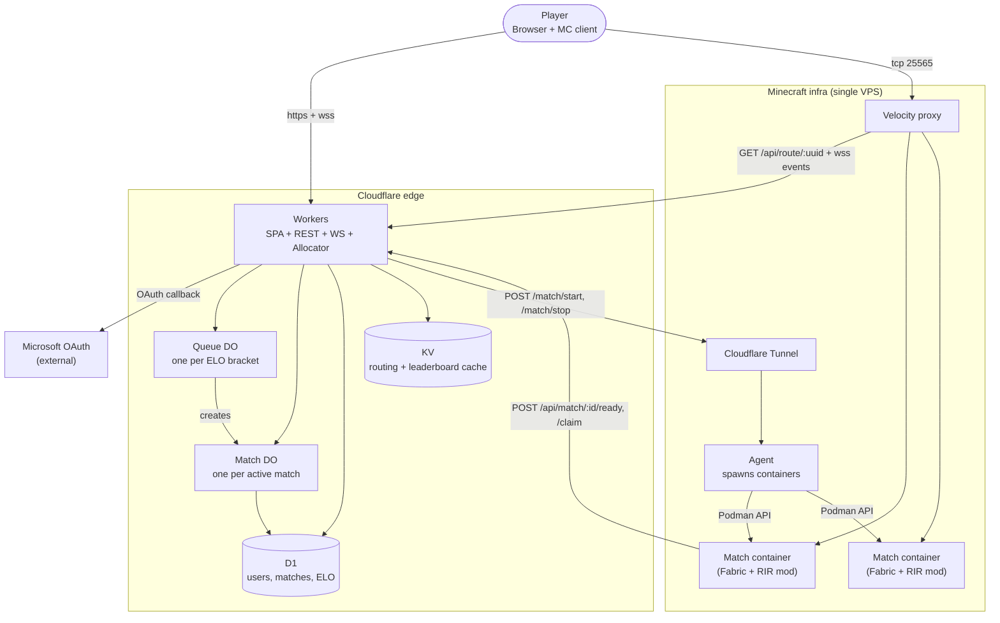

# Random Item Race — Architecture

A competitive Minecraft minigame where two players drop into a fresh world and race to find a single randomly-chosen item. Matchmaking, ELO, and the pre-game spinning wheel are driven by a web frontend; gameplay runs in an ephemeral Fabric server spun up per match behind a Velocity proxy.

This document is the source of truth for the system design. When in doubt, prefer the explanation here over inferring intent from code.

**Scope for v1:** 1v1 ranked only. FFA (4-player) is planned but explicitly out of scope until the 1v1 loop is solid. The architecture is designed so adding FFA later does not require changes to the Match DO, the Fabric mod, the schema, or the container orchestration — only to the matchmaker, wheel UI, and Elo calculation. See *Open questions* and *Invariants*.

## Goals

- **Public scale.** Anyone can sign in with their Microsoft account and queue. No allowlists, no Discord-gated nonsense.
- **Real ELO.** Matches affect a persistent rating; the leaderboard is the meta-game.
- **Tight loop.** Queue → wheel reveal → connect → race → result, end to end under a minute when matches are forming quickly.
- **Cloud-native, low ops.** Web layer is fully serverless on Cloudflare. A single VPS holds the MC infrastructure with one small custom agent. Goal is to never SSH into anything to keep the system running.

## Non-goals

- Cross-platform with Bedrock. Java only.
- Custom world generation. Use vanilla seeds from a curated pool.
- In-app voice. Discord is fine.
- Anti-cheat beyond basic UUID identity. The game is short and the worlds are fresh; cheating is mostly self-defeating.

## High-level architecture

Two tiers that talk to each other over HTTPS:



**Cloudflare tier** runs everything stateless and everything stateful that doesn't need real game compute. The frontend SPA (static assets), the REST API, matchmaking, live match coordination, ELO, leaderboard, container allocation, the pre-game wheel — all served from a single Worker with Durable Objects, D1, and KV bindings. No separate Pages project; Workers now serves static assets directly, so the SPA bundle and the API live in the same deploy unit at the same origin.

**Minecraft tier** is what Cloudflare cannot do: long-running JVM processes simulating a Minecraft world. It runs on a single VPS. Velocity is the only thing exposed publicly on the TCP side; backend match containers are reachable only on a private Podman network. The Agent is reached from Cloudflare via Cloudflare Tunnel (no public agent endpoint).

## Components

### Web frontend (SPA inside the Worker)

- **Stack:** Vite + React, built into static assets and served by the same Worker that handles the API. No separate Pages project. The Worker's `assets` binding with `not_found_handling: "single-page-application"` makes client-side routes work for deep links.
- **Routing:** React Router (`react-router-dom`). Five routes total — not enough to justify TanStack Router's complexity.
- **Data fetching:** Native `fetch()` with a small handful of custom hooks. No TanStack Query. The app has ~10 endpoints, all called from at most one component each; caching layers would be paying upkeep for capability we don't use.
- **Components:** shadcn/ui, installed with preset `b2Cin5DQO`. Tailwind underneath.
- **Routes:** `/` (landing + leaderboard), `/login` (OAuth start), `/queue` (queue + wheel + post-match), `/profile/:uuid`, `/match/:id` (post-match result page).
- **WebSockets:** native `WebSocket` for the queue + match sockets. Per-route hooks own their own sockets.
- **Auth:** session cookie set by the Worker after OAuth completes. HTTP-only, `SameSite=Lax`, signed. Because frontend and API share an origin (no `api.` subdomain), cookies flow automatically — no CORS, no token juggling. The frontend reads `/api/me` on boot to hydrate auth state.

The wheel is `react-custom-roulette` or hand-rolled with `transform: rotate()` + cubic-bezier ease-out. It receives the target item from the `match_found` WebSocket message, animates landing on that item, then renders the connect-now panel with the server address. In 1v1 the wheel shows both players' avatars on opposite sides — it's a head-to-head ritual, not a solo reveal.

### Worker (API + static assets)

A single Hono app exposing the REST API + WebSocket upgrades to the right Durable Object, *and* serving the React SPA bundle via the `assets` binding. Same Worker, same origin, one deploy. The Worker is also the Allocator (calls the Agent over Tunnel).

Routing model is configured in `wrangler.jsonc`:

```jsonc
{
  "$schema": "./node_modules/wrangler/config-schema.json",
  "name": "rir",
  "main": "./worker/index.ts",
  "compatibility_date": "2026-05-15",
  "assets": {
    "directory": "./dist",
    "binding": "ASSETS",
    "not_found_handling": "single-page-application",
    "run_worker_first": ["/api/*"]
  },
  "durable_objects": {
    "bindings": [
      { "name": "QUEUE", "class_name": "Queue" },
      { "name": "MATCH", "class_name": "Match" }
    ]
  },
  "d1_databases": [
    { "binding": "DB", "database_name": "rir", "database_id": "..." }
  ],
  "kv_namespaces": [
    { "binding": "ROUTING", "id": "..." },
    { "binding": "CACHE", "id": "..." }
  ],
  "migrations": [
    { "tag": "v1", "new_sqlite_classes": ["Queue", "Match"] }
  ]
}
```

What this does:

- `/api/*` → Worker code runs (the Hono app handles routing internally)
- `/assets/...`, `/index.html`, any built file → served directly from `./dist`, no Worker invocation, free
- Any other path (e.g. `/queue`, `/profile/abc`) → serves `index.html`, React Router takes over client-side

Routes the Worker handles:

- `POST /api/auth/microsoft/start` → returns OAuth URL with state
- `GET  /api/auth/microsoft/callback` → runs the MS → XBL → XSTS → MC chain, sets session
- `GET  /api/me` → current user (UUID, name, ELO, stats)
- `GET  /api/queue/join` (WebSocket upgrade) → routes to the right Queue DO
- `GET  /api/match/:matchId/ws` (WebSocket upgrade) → routes to the Match DO
- `GET  /api/velocity/events` (service WebSocket upgrade) → routes to the Match DO event stream; used by Velocity for match readiness pushes
- `POST /api/match/:matchId/ready` → forwarded to Match DO; called by Fabric mod after boot + pregeneration completes
- `POST /api/match/:matchId/claim` → forwarded to Match DO; called by Fabric mod
- `GET  /api/route/:uuid` → returns where Velocity should send this player
- `GET  /api/leaderboard` → KV-cached top 100

The Worker holds no state. It is a router, a thin auth layer, the proxy for Agent calls, and the static-asset edge.

### Queue DO

One instance per ELO bracket. Brackets are static and named: `bracket:0-1100`, `bracket:1100-1200`, `bracket:1200-1300`, etc. Bracket width is **100 ELO** in 1v1 — tighter than FFA would need, because head-to-head matches are more sensitive to skill mismatch. Players are routed to a bracket DO based on their current ELO at queue time.

Responsibilities:

1. Hold a WebSocket for each waiting player using the **WebSocket Hibernation API**. Players queuing is the most common idle state in the system; if it billed compute the cost model would not work.
2. Persist queue entries (`q:<uuid>` → `{elo, joinedAt}`) in DO storage so eviction doesn't drop the queue.
3. On each join, attempt match formation. Match = take the oldest 2 players, mint a `matchId`, call the Allocator to spin up a container, spin up a Match DO via `idFromName`, hand them off, and close their queue sockets with `match_found`.
4. Auto-respond to client ping with pong via `setWebSocketAutoResponse` so heartbeats don't wake the DO.

There is no separate matchmaker process. The matchmaker runs inline on the join handler. The bracket DO is itself a single-writer actor, which means "form a match" is automatically race-free — no two concurrent joins can claim the same player.

**Bracket widening.** A player who has waited longer than 30s in a thin bracket becomes eligible for adjacent brackets. Implemented as: each bracket DO, on a timer, checks its oldest waiter; if past threshold, calls `tryBorrow()` on the neighboring DO to pull a player. Adds bounded latency to matching across sparse brackets; never blocks a fast match in a hot bracket.

### Match DO

One instance per active match, keyed by `matchId`. Lives from match formation until ~30s after the winner is declared, then hibernates and is evicted naturally.

Responsibilities:

1. Hold the match metadata (`players: string[]`, target item, started_at, container address). Stored as an array so adding FFA later is a player-count change, not a schema change.
2. Write routing entries (`route:<uuid>` → `matchId`) into KV with 30-minute TTL so Velocity can resolve the player on join.
3. Hold the match WebSocket connections — one per player for the in-match HUD, plus optional spectators.
4. Hold privileged Velocity event subscribers. Velocity keeps a service WebSocket open so Match DOs can push lifecycle events without polling or exposing a public endpoint on the VPS.
5. Mark the container ready. After the Fabric mod completes boot + pregeneration, it calls `POST /api/match/:matchId/ready`; the Match DO stores `ready_at`, broadcasts `{type:"match_ready", matchId, players, serverAddress}` to Velocity, and broadcasts readiness to match WebSockets.
6. Arbitrate `/claim`. **The single most important guarantee in the system.** When the Fabric mod detects a player picked up the target item, it POSTs to `/match/:id/claim`; the DO uses `blockConcurrencyWhile` to atomically set the winner. First call wins; subsequent calls see the existing winner and respond truthfully.
7. On winner set: persist the match to D1, recompute Elo for all participants in a single batched transaction, bust the leaderboard cache, broadcast the winner over WebSockets, request container teardown from the Agent.

The DO is the only place in the system where multi-writer arbitration matters. Everywhere else, last-write-wins is fine or there's only one writer.

### Allocator (inside the API Worker)

When the Queue DO forms a match, it calls the Worker's internal `allocate(matchId, players, targetItem)` function, which:

1. POSTs to the Agent's `/match/start` over Cloudflare Tunnel with the match config (UUIDs, target item, world seed, JVM flags, view distance — see *Resource budget*).
2. Receives `{serverName, address}` from the Agent within a few hundred ms (the Agent calls Podman's container-create + container-start endpoints, which return quickly even before the JVM is fully booted).
3. Writes `route:<uuid>` for each player into KV so Velocity can look them up. Routes are assigned immediately, but the Match DO is the source of truth for whether the backend is ready.
4. Returns the address to the Queue DO so it can include it in the `match_found` message.

The container's mod boots in ~10-15s. The wheel animation on the frontend covers most of this. Players who are already connected to `lobby` are moved automatically only after the Match DO receives the Fabric ready callback and pushes `match_ready` to Velocity. Players who connect after readiness route directly to the match server.

### D1

SQLite at the edge. Schema is small and stable.

```sql
CREATE TABLE users (
  mc_uuid     BLOB PRIMARY KEY CHECK(length(mc_uuid) = 16), -- 16-byte UUID
  mc_name     TEXT NOT NULL,           -- current MC username, refreshed on login
  elo         REAL NOT NULL DEFAULT 1000,
  matches     INTEGER NOT NULL DEFAULT 0,
  wins        INTEGER NOT NULL DEFAULT 0,
  created_at  INTEGER NOT NULL          -- unix seconds
);

CREATE TABLE matches (
  match_id    TEXT PRIMARY KEY,
  target_item TEXT NOT NULL,            -- e.g. minecraft:diamond
  winner_uuid BLOB CHECK(winner_uuid IS NULL OR length(winner_uuid) = 16),
  started_at  INTEGER NOT NULL,
  ended_at    INTEGER
);

CREATE TABLE match_players (
  match_id    TEXT NOT NULL REFERENCES matches(match_id),
  mc_uuid     BLOB NOT NULL REFERENCES users(mc_uuid) CHECK(length(mc_uuid) = 16),
  elo_before  REAL NOT NULL,
  elo_after   REAL,
  placement   INTEGER,                  -- 1 = winner, NULL = forfeit/disconnect
  PRIMARY KEY (match_id, mc_uuid)
);

CREATE INDEX idx_users_elo ON users (elo DESC);
CREATE INDEX idx_matches_ended_at ON matches (ended_at DESC);
CREATE INDEX idx_match_players_uuid ON match_players (mc_uuid, match_id);
```

`match_players` is kept as a separate table even though 1v1 always has exactly two rows per match. The cost of the join is nothing, and it means FFA later is a player-count change, not a schema migration.

D1 is read-mostly here. A match writes ~5 rows. The leaderboard is the only frequent read, and it's cached in KV with a 30s TTL, so D1 rarely sees leaderboard traffic.

### KV

Two logical namespaces:

- `ROUTING` — short-lived keys
  - `route:<uuid>` → `{matchId, serverAddress}` (TTL 1800s, written by Allocator on match start)
  - `pending:<uuid>` → JSON `{matchId, targetItem, serverAddress}` (TTL 60s, fallback for clients that lose the WebSocket between match_found and connect)
- `CACHE` — leaderboard snapshots
  - `leaderboard:top100` → JSON array (TTL 30s, written by API Worker on read miss, busted by Match DO on every match end)

KV is eventually-consistent globally; this is fine for routing (the value is read by Velocity once and is correct for the duration of the match) and for the leaderboard (30s staleness is invisible).

### Cloudflare Tunnel

`cloudflared` runs as a rootless Podman container on the VPS (declared in the Compose file alongside Velocity and the Agent), exposing the Agent's HTTP port to a private hostname on Cloudflare. The Worker reaches the Agent via that hostname over Cloudflare's network. No public agent endpoint, no inbound firewall rule on the VPS for the Agent. Authenticated via a service token in the request header.

### Agent

A small Go process running on the VPS that the Worker calls to spawn and tear down match containers. ~300 lines. Listens on localhost (Tunnel handles ingress) on a private port. Runs as an unprivileged user; talks to **Podman** via its REST API exposed at `$XDG_RUNTIME_DIR/podman/podman.sock` (enabled with `systemctl --user enable --now podman.socket`).

The Agent uses the official **Docker SDK for Go** (`github.com/docker/docker/client`) configured to point at the Podman socket — Podman exposes a Docker-compatible REST API at `/v$VERSION/`, so the same code works against either runtime. Native Podman bindings (`github.com/containers/podman/v5/pkg/bindings`) are available if Podman-specific features (pods, generate kube) are ever needed, but the Docker SDK covers everything in scope here.

Endpoints:

- `POST /match/start` → calls Podman's container-create + container-start with the per-match env (matchId, target item, seed, allowed UUIDs, JVM flags, view distance), returns `{serverName, address}` once Podman reports the container as running. Tracks the container in an in-memory map keyed by matchId. Sets a 15-minute hard timeout to force-kill orphans.
- `POST /match/stop` → Podman stop with 30s grace, then cleanup.
- `GET  /health` → reports container count, ports in use, basic metrics.

Subscribes to Podman's events stream (`/events`) and notifies the Worker when a container exits unexpectedly. Match cleanup is idempotent: the Match DO requests stop on win, and the Agent's exit-watcher also tells the Worker if the container dies for any other reason.

Containers run on a dedicated Podman network (`rir-net`). Velocity is on the same network and addresses match containers by name (`match-abc12345`). No host port allocation; containers expose 25565 internally only.

### Velocity proxy

Single Velocity instance on the VPS (rootless Podman container declared in the Compose file, on the same Podman network as match containers). Configured for **modern forwarding** (online-mode in Velocity, offline-mode in backend Fabric servers — Velocity passes the verified UUID through). One plugin: `RIRRouter`.

`RIRRouter` does three things:

1. On `PlayerChooseInitialServerEvent`: fetch `GET /api/route/<uuid>` from the Worker. If a ready match is assigned, register the target server on-the-fly via `proxy.registerServer(...)` if not already registered, then set as initial server. Default to `lobby` if no match or if the assigned match is not ready yet.
2. Keep a privileged WebSocket open to the Worker/Match DO event stream. On `{type:"match_ready", matchId, players, serverAddress}`, register the match server and connect any listed players who are currently in `lobby` to that backend. Offline players are left alone; their KV route handles their next join. Players already on the match server are no-ops.
3. On `ServerPostConnectEvent` (player joined a match server), player disconnect, and match-end notification: unregister the server when the last player leaves, keeping the registration table clean.

Backend match servers are addressed by their Podman network name (`match-<short-id>:25565`). The lobby server is statically registered.

### Fabric match container

An OCI image (`rir-game:latest`) running Fabric + the **RIR mod** + a fixed set of performance mods (see *Resource budget*). Each container instance hosts exactly one match. Built once (via `podman build` or any OCI builder), tagged, pushed to a registry.

Lifecycle:

1. Agent creates the container via Podman with env vars: `MATCH_ID`, `TARGET_ITEM`, `WORLD_SEED`, `ALLOWED_UUIDS`, `VIEW_DISTANCE`, `JVM_FLAGS`, `API_BASE`, `API_TOKEN`. Container is created with auto-remove on exit.
2. Entrypoint writes `server.properties` from env, then starts the JVM.
3. Mod's `onServerStarting` pregenerates a 12-chunk-radius region around spawn (see *Pregeneration*).
4. After pregeneration completes and the server is joinable, POST `/api/match/<matchId>/ready` to the Worker. The Match DO then pushes readiness to Velocity so lobby players can be moved into the match.
5. On `ServerPlayConnectionEvents.JOIN`: verify the player's UUID is in `ALLOWED_UUIDS` (kick if not), fetch match state from the Worker (`GET /api/match/state/<uuid>`), announce target item in chat.
6. Each server tick, scan online players' inventories for the target item. If found, POST `/api/match/<matchId>/claim` with the UUID. The Match DO answers with the canonical winner — the mod believes the DO, not its own scan.
7. On winner declared (from claim response or WebSocket from Match DO): show a 10-second result screen, then `/send everyone lobby`.
8. After all players leave or 15-minute timeout, exit cleanly. Agent's Podman events watcher notifies the Worker; container is auto-removed.

The container is **single-use**. No world reset logic, no slot bookkeeping — a fresh container *is* the fresh world. Match containers run **rootless** (Podman default) — the JVM inside has no path to host root even if the mod is compromised.

### Microsoft OAuth chain

The single trickiest piece of plumbing. Microsoft OAuth alone gives you an MS access token, not a Minecraft identity. To bind a website session to a MC UUID, the Worker performs this chain on OAuth callback:

1. `POST https://user.auth.xboxlive.com/user/authenticate` with the MS access token → Xbox Live token + user hash.
2. `POST https://xsts.auth.xboxlive.com/xsts/authorize` with the XBL token → XSTS token. **Watch for** `XErr=2148916233` (no Xbox profile) and `2148916238` (child account not in a Family). Surface these as friendly errors; they are real users.
3. `POST https://api.minecraftservices.com/authentication/login_with_xbox` with XSTS → MC access token.
4. `GET  https://api.minecraftservices.com/minecraft/profile` with MC token → UUID + current username.

Store the UUID (canonical hyphenated form) in `users`. The MC access token is then discarded — it's not needed afterward because Mojang's online authentication at the Velocity layer is what proves identity in-game.

The session cookie links subsequent web requests to the UUID. Identity in-game comes from Mojang signing the join packet with the same UUID. The link is automatic.

## Resource budget

Per-match container sizing is a real cost driver since each match is its own container. The defaults below are calibrated for 1v1 with view distance 6, which feels good for a fresh-world scavenger race without being expensive.

| | Value | Notes |
|---|---|---|
| Container memory limit | **768 MB** | hard cap; passed to Podman as `--memory=768m --memory-swap=768m` |
| JVM heap (`-Xmx`) | **480 MB** | leaves ~200 MB for JVM native + ~80 MB margin |
| JVM initial (`-Xms`) | 200 MB | grow into the heap rather than pre-allocate |
| GC | G1GC, `MaxGCPauseMillis=50` | low-pause tuned for short matches |
| Container CPU limit | 1.0-1.5 vCPU | tick thread is single-threaded; 1 core suffices |
| View distance | 6 | 13×13 chunks per player |
| Simulation distance | 4 | mob ticking radius |
| Concurrent players | 2 | enforced by `ALLOWED_UUIDS` check on join |
| Hard match timeout | 15 minutes | Agent force-kills past this |

**Required performance mods** (bundled in the image):

- **FerriteCore** — 30-45% memory reduction on chunk/blockstate data
- **Lithium** — general perf, lower GC pressure
- **Krypton** — network stack, smaller buffers
- **ModernFix** — broad memory + startup wins

These are stable, server-side-safe, and don't change gameplay.

### Pregeneration

The Fabric mod calls `world.getChunk(x, z, ChunkStatus.FULL, true)` for a 12-chunk radius around spawn during `onServerStarting`. This converts expensive mid-match chunk generation into a one-time cost during container boot. Tradeoffs:

- Container cold-start grows from ~5s to ~12-15s (CPU-bound during pregen)
- Mid-match heap is steadier; GC pauses are rare
- Players running aggressively outward will still trigger generation, but the *burst* pressure is concentrated at boot, not the race

The frontend's wheel animation hides cold-start latency by design (~5-7s of "spinning" before the player can click connect). With pregeneration, total time from match formation to playable state is ~12s, of which the user perceives maybe 2-3s of actual waiting.

### What sizing to revisit later

If view distance 10 becomes desirable for competitive feel, bump container to **1 GB** (`-Xmx=640m`). Cost goes up ~30% per match — meaningful at scale, irrelevant at small scale. Default for v1 is VD 6 / 768 MB; revisit after launch based on player feedback.

When FFA-4 is added, it gets a separate container size: **1.5 GB at VD 8**. The Allocator picks the size from the match type. The container image is unchanged; sizing and JVM flags are env vars.

## Key flows

### Account linking

```
Browser → Worker GET /login (served as static SPA route)
Browser → Worker POST /api/auth/microsoft/start
Worker → returns MS OAuth URL with random state
Browser → MS (sign-in)
MS → Worker GET /api/auth/microsoft/callback?code=...
Worker → MS token endpoint (code → MS access token)
Worker → XBL → XSTS → MC profile (the chain)
Worker → D1 INSERT/UPSERT users
Worker → set session cookie, redirect to /queue
```

### Queue → match formation

```
Browser → Worker GET /api/queue/join (Upgrade: websocket)
Worker → Queue DO for the user's bracket (idFromName "bracket:1100-1200")
Queue DO → accepts WS with hibernation, stores q:<uuid> in DO storage
Queue DO → sends {type: "queued", position: N}

(2nd compatible player joins, same DO instance)

Queue DO → picks oldest 2 from storage
Queue DO → mints matchId, picks random target item from pool
Queue DO → calls Worker allocate(matchId, players, targetItem)
Allocator → Agent /match/start over Tunnel (Podman create + start)
Agent → returns {serverName, address} within ~300ms
Allocator → writes route:<uuid> → {matchId, address} to KV for each player
Allocator → returns address to Queue DO
Queue DO → creates Match DO via idFromName(matchId), seeds with players + item + address
Queue DO → sends each waiting socket {type: "match_found", matchId, targetItem, serverAddress, wsUrl}
Queue DO → closes each socket, deletes q:<uuid>
```

The frontend then opens a new WebSocket to the Match DO and starts the wheel animation, landing on `targetItem`. The container is finishing its pregeneration in parallel; by the time the wheel completes, the server should be close to join-ready. If the player is already connected to the Minecraft lobby, Velocity waits for the Match DO's `match_ready` event before moving them.

### Match readiness → lobby transfer

```
Fabric mod completes boot + pregeneration
Fabric mod → Worker POST /api/match/<matchId>/ready
Worker → Match DO fetch /ready
Match DO:
  - stores ready_at
  - broadcasts {type:"match_ready", matchId, players, serverAddress} to Velocity service WS
  - broadcasts readiness to player match WebSockets
Velocity:
  - registers serverAddress if needed
  - for each listed UUID currently connected to lobby, calls createConnectionRequest(matchServer).connect()
  - leaves offline players alone; /api/route/:uuid handles their next join
```

### In-match: claim arbitration

```
Player picks up target item in-game
Fabric mod tick detects it in inventory
Fabric mod → Worker POST /api/match/<matchId>/claim {uuid}
Worker → Match DO fetch /claim {uuid}
Match DO blockConcurrencyWhile:
  - read winner from storage
  - if set: return {winner, youWon: false}
  - else: set winner = uuid, persist to D1, bust KV cache, broadcast WS,
          fire-and-forget Allocator /match/stop
  - return {winner: uuid, youWon: true}
Fabric mod receives response, announces in chat, schedules /send to lobby
Agent → Podman stop with 30s grace → container exits
```

`blockConcurrencyWhile` is what makes this race-free. Two near-simultaneous claims serialize cleanly: the second sees the winner already set and reports `youWon: false` to its caller. The Fabric mod uses this to handle the "I picked it up first" / "no you didn't" disagreement correctly. In 1v1 this matters less than it would in FFA (only two possible claimants) but the mechanism is the same; correctness comes free.

### Elo update

1v1 is standard Elo. For player A with rating $R_A$ playing player B with rating $R_B$:

$$E_A = \frac{1}{1 + 10^{(R_B - R_A)/400}}, \quad E_B = 1 - E_A$$

$$R'_A = R_A + K(S_A - E_A), \quad R'_B = R_B + K(S_B - E_B)$$

where $S_A \in \{0, 1\}$ depending on outcome and **K = 24**.

A typical match swings ±12-18 points depending on rating gap. After ~30 matches a player's rating is well-calibrated for matchmaking.

All updates are written in a single `DB.batch()` so the match record, the `match_players` rows, and the user Elo updates either all land or none do. The leaderboard cache is busted last.

When FFA-4 is added, the calculation extends to pairwise-against-the-winner with K=32. The storage layer and DO logic do not change.

If we move to Glicko-2 later, the schema gains `rd REAL` and `vol REAL` columns and the calculation moves to a per-rating-period batch.

## Design decisions

The rationale matters more than the implementation; reread this section before making "small changes" that ripple.

### Why Cloudflare for the web tier

The alternative was a long-running Node/Bun process on a VPS. Simpler in absolute terms — variables in memory, no actor model, one debugger. We picked Cloudflare because:

- We explicitly do not want to think about ops. CF compute is zero-ops in a way that systemd + Docker + Caddy + Postgres backups is not, even when each individual piece is easy.
- Cost scales the right way: idle costs almost nothing. A side project that gets popular for two days then quiets down doesn't leave a $40/mo VPS humming.
- DDoS protection, edge cache, and TLS are free.

The cost is the unfamiliar primitives. We pay that cost in the Queue and Match DOs. Everywhere else, code is straightforward.

### Why Vite + React on Workers (not Next.js, not Pages)

Two decisions, one rationale.

**Not Next.js:** the backend is a separate Worker, so we have no use for Next.js's server-side rendering, server actions, or route handlers. Everything dynamic lives in the Worker's `/api/*` paths. What we actually want is a fast static SPA — which is exactly what Vite + React produces. Smaller bundle, faster dev loop, no Next.js abstraction overhead we wouldn't use anyway.

**Not Pages:** Workers can serve static assets directly (`assets` binding + `not_found_handling: "single-page-application"`). The SPA bundle and the API live in the same Worker, deployed in one operation, served at the same origin. Cloudflare has been explicit since early 2026 that this is the preferred path for new projects — Pages remains supported but isn't getting feature investment. Concrete wins from collapsing it into one Worker: same-origin cookies (no CORS), one URL (no `api.` subdomain to manage), one deploy command, atomic SPA-and-API releases, and the SPA can call `env.ASSETS.fetch()` from inside the Worker if we ever need server-side template rendering.

The cost of dropping Next.js is losing file-based routing, RSC, and image optimization. We don't need them. React Router gives us routing in the dozen lines it takes to declare five routes, and image optimization is irrelevant for a UI that's mostly text and a wheel.

### Why no TanStack Router/Query

The app has five routes and roughly ten API endpoints. React Router with native `fetch()` and `useState` covers this in two-thirds the dependency surface and zero new abstractions to learn. TanStack Query is excellent at request caching, deduplication, and stale-while-revalidate semantics — none of which we benefit from at this scale (most endpoints are called from at most one component, and the leaderboard's caching happens server-side in KV). If a future page genuinely needs aggressive client-side caching, we add Query then. Until then it's upkeep for unused capability.

### Why Durable Objects (and only here)

DOs are not the default. They answer two specific needs:

1. **Single-writer arbitration.** The `/claim` endpoint must produce exactly one winner regardless of how many near-simultaneous calls arrive. D1 plus a conditional update gets you close but every subsequent reader has to re-check; a DO makes the actor model the abstraction, which is cleaner.
2. **Connection-bearing state.** WebSockets need to live somewhere. Workers can't hold them; D1 can't hold them. The DO is the only CF primitive that can.

The Queue DO has both properties; the Match DO has both properties. Nothing else in the system does. Adding a DO for routing, leaderboard, or profile would be over-engineering: those are pure read-heavy lookups, and KV plus D1 handle them better.

### Why WebSockets (and not polling)

Polling would have worked. We chose WebSockets because:

- Both players' wheel animations need to start on the same frame. With polling, the two clients see `match_found` at staggered times spanning up to one poll interval; the dramatic moment is degraded.
- Live updates during the race (winner declared, opponent disconnect) are essentially free with sockets; with polling we'd add the cost of every client hammering the API for the full duration.
- WebSocket Hibernation makes the cost model work even at hundreds of idle queuers.

The cost is that the Queue and Match DOs become the load-bearing components. We accept this; they earn it.

### Why D1 (not Postgres)

For the read/write shape of this system — a handful of writes per match, mostly reads via UUID or a top-N leaderboard — D1 is plenty. The 10 GB cap accommodates millions of matches before becoming a concern. Hyperdrive + a managed Postgres (Neon, Supabase) is the migration path if we ever outgrow D1; the schema ports cleanly.

D1's eventual consistency at the edge is not a concern: the only consistency-sensitive write path is the per-match Elo update, which is a single `batch()` written from the Match DO — itself the canonical writer for that match.

### Why one-container-per-match

Considered alternatives:

- **Pool of long-lived JVMs with Fantasy dimensions.** Saves ~50% RAM (one JVM hosts several matches as separate dimensions). Loses: crash isolation (one bug takes down everyone in the JVM), shared-state bleed (scoreboards, advancements, command output leaking between matches), atomic updates (restart kicks everyone). Net: not worth it at this scale.
- **VM-per-match.** Stronger isolation than containers, but ~30s boot time is too slow for the queue→connect loop and the cost is ~2x containers.
- **Container-per-match.** Each match is a fresh JVM, fresh world, fresh everything. Crash blast radius is one match. Updates are free — new image tag → future matches use it, in-flight matches finish on the old one. Cleanup is "container exits."

The cost is RAM: 768 MB × concurrent matches vs ~3 GB for a 4-match pooled JVM. At our scale (hundreds of matches/day, dozens concurrent peak), the RAM tax is small dollars per month and the operational simplicity is enormous.

### Why Go + Podman + Agent (not k8s, not Nomad, not Docker)

For a single VPS with ~25 concurrent matches:

- **Kubernetes (incl. k3s)** is the wrong shape. K8s assumes pods are interchangeable; game servers are not. You'd write a custom Operator anyway, and pay the cluster operational tax for nothing. Skip.
- **Agones** on k8s solves the game-server case properly. Use it if you're already running k8s for other reasons. We are not.
- **Nomad** is a credible single-binary alternative — submit job, it runs, query state via HTTP. Worth it the moment we have a second VPS. For now, the Agent is ~300 lines we fully understand.
- **ECS Fargate / Fly Machines** are good hosted options if we don't want to run a VPS at all. Fly Machines specifically has fast cold starts and a clean API. Reasonable graduation path; see *Scaling plan*.

**Why Podman instead of Docker:** Podman runs containers rootless by default. Match containers execute mod code that processes player-driven input (chat, world interactions, network); even if a bug or supply-chain compromise gives that code arbitrary execution, the blast radius is a user-namespace-mapped UID, not host root. Podman is also daemonless — no privileged background process to compromise — and is API-compatible with Docker for everything we do. The only thing we give up is a slightly less mature ecosystem of third-party tooling (`docker-compose` → `podman-compose`, fewer Stack Overflow answers). For this use case the security win is unambiguous.

**Why Go for the Agent:** Both Docker and Podman are written in Go; the official SDKs are first-class. We use `github.com/docker/docker/client` pointed at the Podman socket — same code works against either runtime, the API is well-documented, and the binary is a single static file shipped in an OCI image and run via Compose. Go's standard library covers everything (HTTP server, contexts for cancellation, JSON). Rust was considered (`bollard` is the equivalent crate) but the ecosystem is smaller, async story heavier, and there's no performance benefit for an I/O-bound orchestrator. Rust would mostly be paying complexity tax.

**Why podman-compose over Quadlet:** For three static services on a single VPS, Compose is the lower-friction choice. One YAML file readable in 30 seconds, familiar mental model (compose is the same shape across Docker and Podman), trivial deploy via `podman-compose up -d`, `compose.yaml` lives in the repo alongside everything else. Quadlet's systemd integration matters more for fleet management, complex dependency graphs, or services with strict uptime SLAs — none of which apply here. The OCI images are unchanged, so we can switch to Quadlet later if scope grows; it's purely a question of which thing invokes Podman.

The decision is "smallest thing that works." Go + Podman + Compose + Agent + Tunnel is that thing.

### Why Cloudflare Tunnel (not a public Agent endpoint)

The Worker needs to reach the Agent on the VPS. The options are: (a) expose the Agent on a public HTTPS endpoint with mTLS / token auth, (b) Cloudflare Tunnel.

Tunnel is purpose-built for this: no inbound firewall rule on the VPS, no public endpoint to harden, no certificate management, and the Worker addresses the Agent via a private hostname on Cloudflare's network. Free, takes 10 minutes to set up. The alternative (public endpoint with mTLS) is more attack surface for no benefit.

### Why static ELO brackets

Adaptive brackets ("find me one opponent within ±100 ELO") sound nice but are harder to reason about with DOs — every player's bracket would float, you'd lose the locality of a bracket DO. Static brackets with widening is simpler and good enough: a player at 1180 always queues in `bracket:1100-1200`; after 30s they become eligible for adjacent brackets.

If a player count justifies it, halve the bracket width and add more DOs. Cheap operationally.

### Why 1v1 first

Scoping the v1 to 1v1 cuts surface area without compromising the architecture. Matchmaking is `O(2)`; Elo is standard rather than pairwise-against-winner; the wheel is a duel ritual rather than a group reveal; the container resource budget is a single number rather than a per-match-type table. We get to launch sooner and learn what's actually worth investing in for FFA.

The architecture is designed so 1v1 → FFA is additive, not transformative. See *Invariants*.

## Data model summary

| Where | Key | Value | TTL | Writer |
|---|---|---|---|---|
| D1 `users` | `mc_uuid` | profile + ELO | forever | Match DO (on result), Worker (on OAuth) |
| D1 `matches` | `match_id` | match record | forever | Match DO |
| D1 `match_players` | `(match_id, mc_uuid)` | per-player result | forever | Match DO |
| DO storage (Queue) | `q:<uuid>` | `{elo, joinedAt}` | until matched | Queue DO |
| DO storage (Match) | `matchId, players, targetItem, winner, startedAt, readyAt, address` | scalar fields | hibernation | Match DO |
| KV `ROUTING` | `route:<uuid>` | `{matchId, serverAddress, ready}` | 1800s | Allocator + Match DO readiness update |
| KV `ROUTING` | `pending:<uuid>` | match info JSON | 60s | Queue DO |
| KV `CACHE` | `leaderboard:top100` | JSON array | 30s | API Worker (read), Match DO (bust) |

## Deployment topology

- **Cloudflare account** holds: 1 Workers project (SPA assets + API + DOs in one deploy), 1 D1 database, 1 KV namespace (with `ROUTING` and `CACHE` bindings), 1 Tunnel.
- **GitHub repo:**
  - `apps/web/` — single project containing the React SPA *and* the Worker that serves it:
    - `src/` — React app (Vite entry)
    - `worker/index.ts` — Hono entry, `Queue` and `Match` DO class exports
    - `worker/auth.ts`, `worker/allocator.ts`, etc.
    - `wrangler.jsonc`, `vite.config.ts`, `index.html`, `package.json`
    - `dist/` — Vite build output, served by the Worker's `assets` binding
  - `apps/agent/` — VPS-side container orchestrator (Go, talks to Podman via Docker SDK)
  - `apps/velocity-plugin/` — Java Gradle project for `RIRRouter`
  - `apps/fabric-mod/` — Fabric mod for the gameplay loop, packaged into `rir-game` OCI image
  - `infra/` — D1 migrations, deploy scripts, `compose.yaml` for the VPS (Velocity + Agent + cloudflared)
- **Vite plugin:** `@cloudflare/vite-plugin` integrates dev and build with Wrangler. `npm run dev` runs Vite + a local Worker simulator in one process; `npm run build` produces the `dist/` directory that the deployed Worker serves.
- **VPS static services** run as rootless Podman containers declared in a single `compose.yaml`, brought up with `podman-compose up -d`. Each service has `restart: always`. Match containers are **not** in the Compose file — the Agent spawns them dynamically via the Podman socket and attaches them to the `rir-net` network so Velocity can reach them.
- **CI:** GitHub Actions deploys on push to `main`. The web/Worker job runs `npm run build && wrangler deploy` (one command deploys SPA + API + DOs). The Agent and Velocity jobs build OCI images and push to a registry, the VPS pulls on a scheduled cycle (or via webhook → `podman-compose pull && podman-compose up -d`).
- **Secrets:** Wrangler secrets for `MS_CLIENT_ID`, `MS_CLIENT_SECRET`, `SESSION_SECRET`, `AGENT_SERVICE_TOKEN`. The Agent has a matching `API_TOKEN` for callbacks to the Worker (loaded via Compose's `env_file` directive from a `.env` outside the repo). Service tokens rotated quarterly.
- **DNS:** `rir.yourdomain.com` (or apex) → Worker. Single hostname for both SPA and API; no `api.` subdomain. `mc.yourdomain.com` → A record to VPS Velocity. Agent has no public DNS — reached via Tunnel only.

## Scaling plan

In rough order of when each becomes relevant:

1. **More concurrent matches than the VPS can hold.** Upgrade the VPS. A 32 GB box holds ~25-30 concurrent 1v1 matches with comfortable headroom. CCX33 → CCX43 → CCX53 is a long runway.
2. **Leaderboard pressure on D1.** Already cached in KV; if reads ever become an issue, lengthen the TTL or pre-render on Match DO writes.
3. **Multi-host.** When one VPS isn't enough, add a second running the same Agent + Velocity stack. The Allocator picks a host based on free-slot reports from each Agent. At this point migrating the Agent to Nomad is the natural move — Nomad does the host-picking for us. The Worker contract is unchanged.
4. **Multi-region.** Workers already run everywhere. MC servers in a second region require a per-region Velocity instance + smart DNS or letting users pick a region at queue time. Adds a "region" dimension to ELO brackets.
5. **Outgrow VPS entirely.** Move match containers to Fly Machines (fast cold starts, per-second billing, anycast IPs). Velocity moves to Fly as well; the Agent dissolves entirely (the Worker calls Fly's API directly).
6. **More than 10 GB in D1.** Migrate to Postgres on Neon via Hyperdrive. Schema unchanged.

## Open questions and future work

- **FFA-4 (4-player free-for-all).** The next mode. Adds a 1.5 GB container size class, pairwise-against-winner Elo with K=32, FFA bracket width 200, and a 4-way wheel UI. Match DO, Fabric mod, schema, and container orchestration are unchanged.
- **Spectator mode.** Match DO already supports extra WebSocket connections; just need a frontend route and a permission check.
- **Replays.** Match DO could persist a tick-by-tick log of "who did what when" to R2, replayed on the frontend. Big scope, defer.
- **Custom item pools per match.** Today the target item is sampled uniformly from a hardcoded list. Eventually we want themed pools ("rare items only", "tools only") selectable from the queue UI.
- **Parties.** Queue with a friend. Complicates matchmaking (a 2-party vs another 2-party for 2v2? Or block parties in 1v1?) and ELO (single rating? team rating?). Defer until users ask.
- **In-game wheel reveal.** Mod-side replay of the wheel using `ItemDisplay` entities is pure polish. Bank for v1.1.
- **Anti-griefing in lobby.** If griefing becomes a problem, lobby gets `protect` and PvP off.
- **Glicko-2 migration.** Better calibration with smaller player counts. Two-column schema migration; calculation moves to per-rating-period batches.
- **VD 10 mode.** Competitive players may want larger view distance for opponent-tracking. Adds a 1 GB container variant; the Allocator picks based on match type.

## Invariants worth preserving

These are the assumptions the rest of the system relies on. Breaking one is a redesign.

1. **A player's MC UUID is their permanent identity.** Microsoft accounts can be renamed; UUIDs are stable.
2. **The Match DO is the only writer for a given match.** Nothing else writes to that `matchId`'s rows in D1 or to its `route:<uuid>` KV entries.
3. **`blockConcurrencyWhile` is the only correctness mechanism for the winner.** Don't add a second one and don't bypass it.
4. **The Worker is stateless.** Any state you find yourself wanting to put in module-level variables in the Worker belongs in a DO.
5. **The Match DO owns match readiness.** Velocity may move players only from a Match DO `match_ready` event or from a route lookup that says the match is ready.
6. **Velocity is the only public TCP entry point to the MC tier.** Match containers bind only to the private Podman network.
7. **The Agent is reached only via Cloudflare Tunnel.** No public endpoint.
8. **One container = one match.** When the container exits, the match is over. No reuse, no reset.
9. **D1 is the system of record.** Caches (KV, in-DO memory) can be wrong transiently; D1 cannot.
10. **A 1v1 match has exactly 2 players.** When this changes (FFA-4), the matchmaker, wheel UI, Elo calculation, and container sizing change together. The Match DO, Fabric mod claim/win flow, schema, and orchestration do **not** change. The `players: string[]` shape and the `match_players` table exist precisely to make this true.
11. **All containers on the VPS run rootless via Podman.** Match containers, Velocity, the Agent, and cloudflared all run as an unprivileged user. There is no `sudo`-required path in the deployment. Compromising any container does not yield host root.
